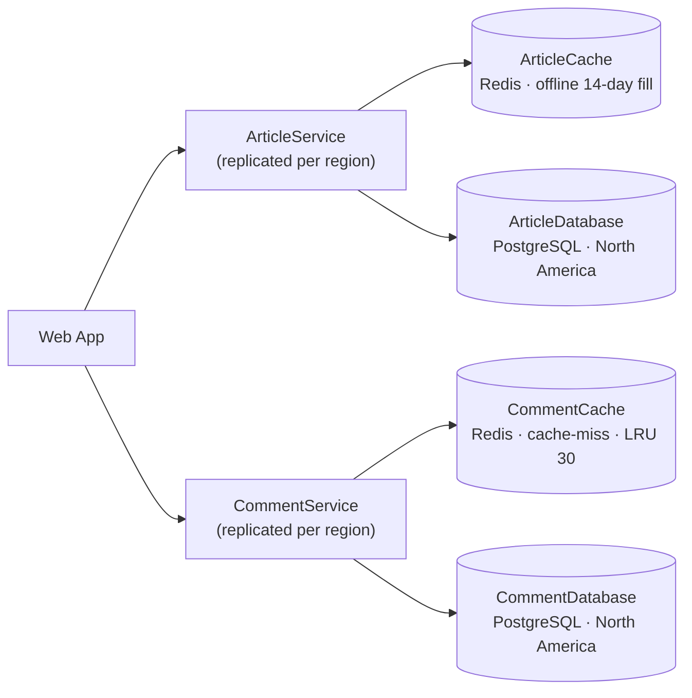

# HappyHeadlines — Cache Layers

DLS Compulsory Assignment #1 (W40): fix HappyHeadlines' availability and
latency by putting cache layers between the region-replicated services and the
distant global databases.

This repo is the **week-1 foundation** for the assignment: the architecture
(C4) and the container topology (Docker Compose). The cache logic and the
hit-ratio dashboard are deliberately left for later weeks.

## The problem

The `ArticleService` and `CommentService` are already replicated to each
region, but they all talk to a single global database instance sitting in
North America. European users see slow responses; some articles become
unavailable. Replicating the database (an x-axis split) was rejected on cost,
so the ARB approved **cache layers** in front of each database instead.

## Architecture (C4)



- **ArticleCache** — an offline process periodically fills it with articles
  from the latest 14 days. Readers get a fast, region-local read.
- **CommentCache** — a cache-miss strategy: on a miss it reads the database
  and stores the comments. It is limited to the 30 most recently accessed
  articles and evicts the least-recently-used when full.

The full text-based C4 model (context + container levels) is in
[`docs/architecture.dsl`](docs/architecture.dsl) — open it with Structurizr
Lite (`structurizr/lite` on port 8080) to browse it interactively.

## Topology (Docker Compose)

| Container | Image | Role |
|---|---|---|
| `article-db`, `comment-db` | `postgres:16-alpine` | global databases (North America) |
| `article-cache`, `comment-cache` | `redis:7-alpine` | the two cache layers |
| `article-service`, `comment-service` | custom Node stubs | region services (cache logic TODO) |

## Running it

```bash
docker compose up --build
```

- ArticleService: `http://localhost:4001/health`
- CommentService: `http://localhost:4002/health`

## Scope

**Done (week 1 — W35 "Foundational tools"):** the C4 model and the Docker
Compose topology with the two cache layers wired in.

**Deferred (later weeks):** the actual cache read-through / offline-fill /
LRU logic, and the cache hit-ratio dashboard.
