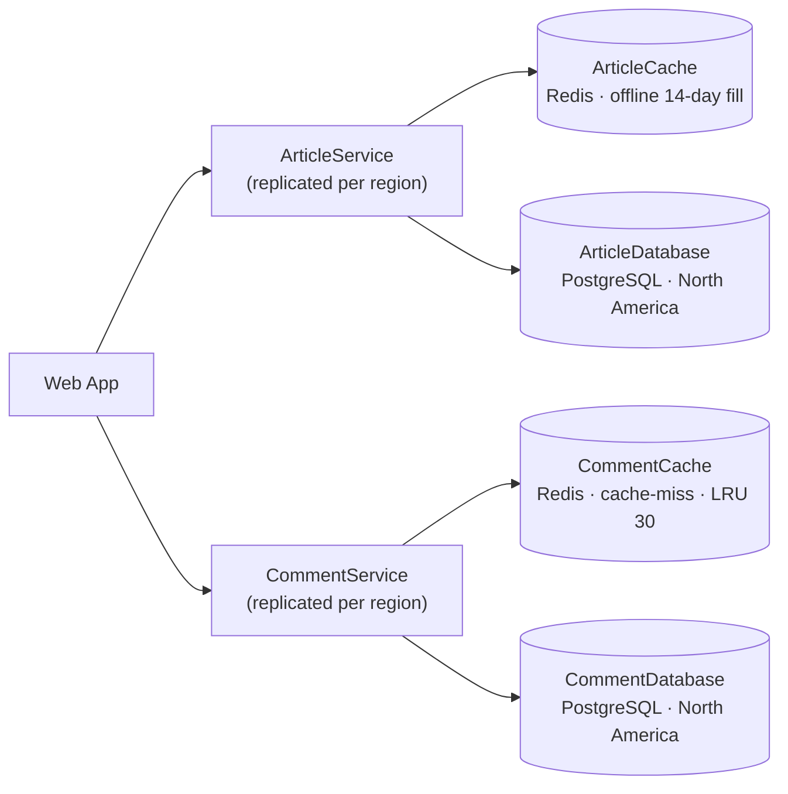

# HappyHeadlines — Cache Layers

DLS Compulsory Assignment #1 (W40): fix HappyHeadlines' availability and
latency by putting cache layers between the region-replicated services and the
distant global databases.

All three deliverables are implemented and runnable (see [Running it](#running-it)):
both cache layers **and** the cache hit-ratio dashboard.

## The problem

The `ArticleService` and `CommentService` are already replicated to each
region, but they all talk to a single global database instance sitting in
North America. European users see slow responses; some articles become
unavailable. Replicating the database (an x-axis split) was rejected on cost,
so the ARB approved **cache layers** in front of each database instead.

## Architecture (C4)



- **ArticleCache** — an **offline** process (`article-fill`) periodically copies
  the latest 14 days of articles into Redis. The service only reads the cache
  and falls back to the database for older articles.
- **CommentCache** — a **cache-miss** strategy: on a miss the service reads the
  database and stores the comments, tracking the most-recently-accessed
  articles in a sorted set. When more than 30 articles are cached, the
  least-recently-used is evicted.

The full text-based C4 model (context + container levels) is in
[`docs/architecture.dsl`](docs/architecture.dsl) — open it with Structurizr
Lite (`structurizr/lite` on port 8080) to browse it interactively.

## Topology (Docker Compose)

| Container | Image | Role |
|---|---|---|
| `article-db`, `comment-db` | `postgres:16-alpine` | global databases (North America), seeded via `db/init-*.sql` |
| `article-cache`, `comment-cache` | `redis:7-alpine` | the two cache layers |
| `article-service`, `comment-service` | custom Node | region services (read-through / cache-miss) |
| `article-fill` | custom Node | the offline 14-day fill process |
| `dashboard` | `nginx:alpine` | the cache hit-ratio dashboard (http://localhost:4003) |

## Running it

```bash
docker compose up --build
```

Then exercise the two strategies:

```bash
# ArticleCache (offline fill)
curl localhost:4001/cache/size            # how many articles the fill cached
curl localhost:4001/articles/1            # recent  -> "source":"cache"
curl localhost:4001/articles/12           # old     -> "source":"db"  (outside 14 days)

# CommentCache (cache-miss + LRU)
curl localhost:4002/articles/1/comments   # first request  -> "source":"db"
curl localhost:4002/articles/1/comments   # second request -> "source":"cache"
curl localhost:4002/cache/stats           # cached articles vs the 30-article cap

# Hit-ratio (drives the dashboard)
curl localhost:4001/cache/hit-ratio       # article cache hits/misses/total/ratio
curl localhost:4002/cache/hit-ratio       # comment cache hits/misses/total/ratio
```

## Dashboard

Open **http://localhost:4003** for the cache hit-ratio dashboard — a small
auto-refreshing page showing hits, misses and hit ratio for both caches.

## Scope

**Done:** C4 model, Docker Compose topology, both cache layers (offline 14-day
fill + cache-miss LRU), and the cache hit-ratio dashboard.
